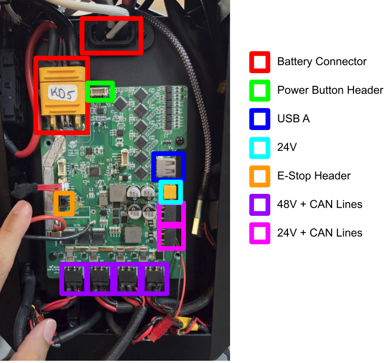
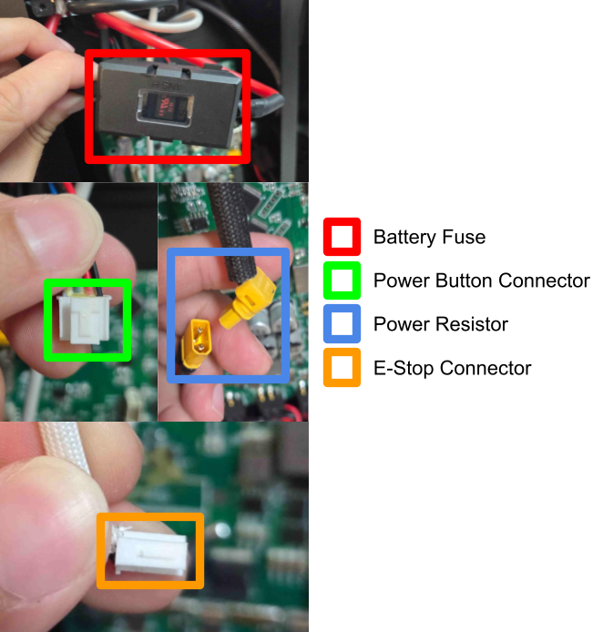

:::note

The K-Bot hardware and software is still under active development and improvement.

**License**
The hardware components of this project are licensed under CERN-OHL-S while the software components are licensed under GPL v3, unless otherwise specified. See [LICENSE-HW](https://github.com/kscalelabs/kbot/blob/master/LICENSE-HW) and [LICENSE](https://github.com/kscalelabs/kbot/blob/master/LICENSE), respectively.

:::

# Electrical System

This guide explains a little bit about how the electrical system is structured.

## Overview

The main battery connector has a 80A fuse. The smaller wires in the connector are used for the battery management system (BMS).
Three main items need to be plugged into the powerboard or it will start beeping. The power button (neon green), the e-stop (orange), and the power resistor (light blue). Each link of the robot needs to be plugged in to the 48V + CAN lines (purple). There are 2 additional CAN lines that provide 24V as shown in (pink). Finally, there is an additional 24V header that we use to power the Raspberry Pi 5 using a buck converter. The USB A should be connected to the Raspberry Pi via a male USB A to male USB A cable.

