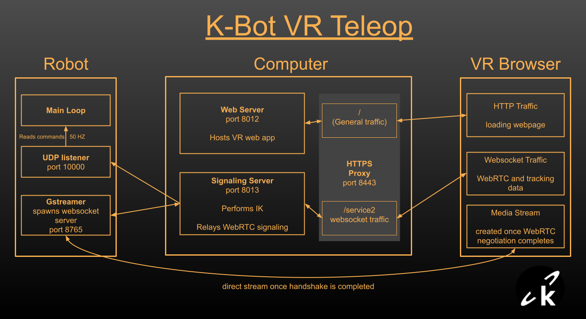
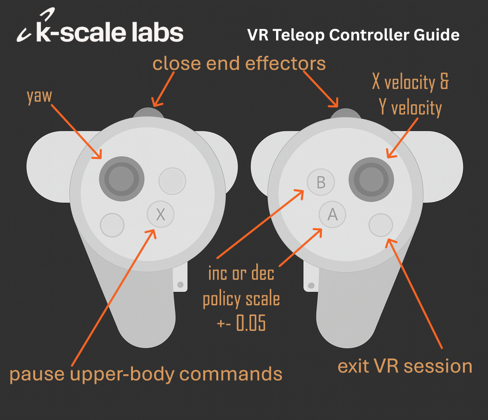

# VR Teleoperation

This guide covers teleoperation of the K-Bot using a Meta Quest VR Headset.

## Prerequisites

- K-Bot (see [Quickstart](./quickstart.md))
- Meta Quest VR headset
- Computer with teleop repository cloned from [kbot_vr_teleop](https://github.com/kscalelabs/kbot_vr_teleop)


## Overview

The K-Bot teleop system uses VR spatial tracking to provide intuitive remote control of the robot.

### System Diagram



**The Robot** runs its main firmware, a GStreamer process with a WebSocket server and a UDP listener that passes commands to the firmware.

**The Intermediary Computer** is not strictly necessary, but it allows us to offload the inverse kinematics from the robot. On-board kinematics aren't very smooth since the CPU on the Raspberry Pi is also streaming two feeds using software encoding.

**The VR Headset** provides hand or controller tracking through a browser web app. No installs required.

### Control Methods

**VR Controllers** provide a more comprehensive interface to control the robot. Joysticks can be used to control the lower body, the robot can be paused, and the analog triggers provide precise control over the end effectors (great for grippers).



**Hand Tracking** allows the user to naturally control the robot's individual fingers by tracking each joint in their hand. The rest of the interface is missing, but that is something being actively explored.

### Video Streaming

Currently, only one video feed is displayed in front of the user. We are actively working on implementing stereo vision for enhanced depth perception. For more details on the video streaming implementation, see the [Video Streaming](./video-streaming.md) page.

## How to Run VR Teleop

### 1. Setup Signaling Server

Create a conda environment and install all required dependencies:

```bash
# Create and activate conda environment
conda create -n teleop python=3.10
conda activate teleop

# Navigate to the teleop repository
cd kbot_vr_teleop

# Install dependencies from requirements.txt
pip install -r requirements.txt

# Install the package in editable mode
pip install -e .
```

The dependencies include:
- `websockets` - WebSocket server/client communication
- `jax` & `jaxopt` - Inverse kinematics optimization
- `numpy` & `scipy` - Array operations and spatial transforms
- `rerun-sdk` - Visualization and logging (includes viewer)
- `urdf-parser-py` - Parsing robot URDF files
- Other utilities

Then run the signaling server:

```bash
cd src/kscale_vr_teleop
python signaling.py
```

The signaling server will:
- Receive joint data from the headset via WebSocket
- Perform Inverse Kinematics calculations
- Forward commands to the robot using UDP
- Relay WebRTC signaling messages
- Launch a Rerun window to visualize and log the robot's movement

### 2. Setup Web Server

```bash
# Navigate to the teleop frontend
cd kbot_vr_teleop/frontend
npm install
npm run start-https
```

The `start-https` command creates a webserver and an HTTPS proxy that:

- **Runs on port 8443** (HTTPS server)
- **Forwards general traffic to port 8012** (React development server)
- **Forwards `/service2` requests to port 8013** (signaling server for WebRTC and inverse kinematics)

### 3. Run Deploy Script and Select Policy

```bash
./firmware/scripts/deploy.sh --gstreamer --command-source udp
```
Visit [kbot_vr_teleop](https://github.com/kscalelabs/kbot_vr_teleop) to see which policy to run. Expect policies to be updated.

### 4. Setup Headset

- Navigate to `https://YOUR_COMPUTER_IP:8443` in the Quest browser. You will probably need to click 'Advanced' and 'Continue' since your certificate will not be trusted. There is no way to add trusted certificates to the Quest.
- Enter the robot's IP address in the web page. This gets sent to the signaling server and tells it how to find the robot.
- Press **Connect**
- Press **X** on the left controller to start sending commands.

## Questions

### Why have the signaling server?

First, inverse kinematics don't run fast enough when also running GStreamer on the Raspberry Pi due to the fact that it is using software encoding with high CPU usage. The signaling server allows us to offload those calculations from the robot.

Secondly, a signaling server is required in order for WebRTC video streaming to work reliably in different network environments. Some networks may not allow the robot or headset to accept inbound connection requests, so having a signaling server in the middle allows both sides to open their own outbound connections. In order to simplify the process for demos, the current signaling server opens connections with the robot. To change it to a true signaling server, move the WebSocket server from `gstreamer.py` on the robot to `signaling.py`.

If you are interested in a TURN relay server, visit our GStreamer repo for instructions on how to setup Coturn.

### Why have the HTTPS proxy?

Quest Headsets will not allow unsecured HTTP or WS connections. Not needed for production.

### Does the headset receive anything besides the video?

The web app receives the results of the inverse kinematics in order to update the robot's URDF (this will probably be removed once stereo vision is improved). It also receives the calculated distance between the user's real position and the solution of the IK, allowing the user to monitor how well their movement is being followed.

### Can I run the web server and signaling server on different computers?

Yes, just update the URL in `App.tsx` or create a text input for it:

```javascript
const [url, setUrl] = useState(`wss://${window.location.hostname}${portString}/service2`)
```

### Which headsets does this work with?

Our teleop stack has been used successfully with Quest Pro, Quest 2, and Quest 3.
